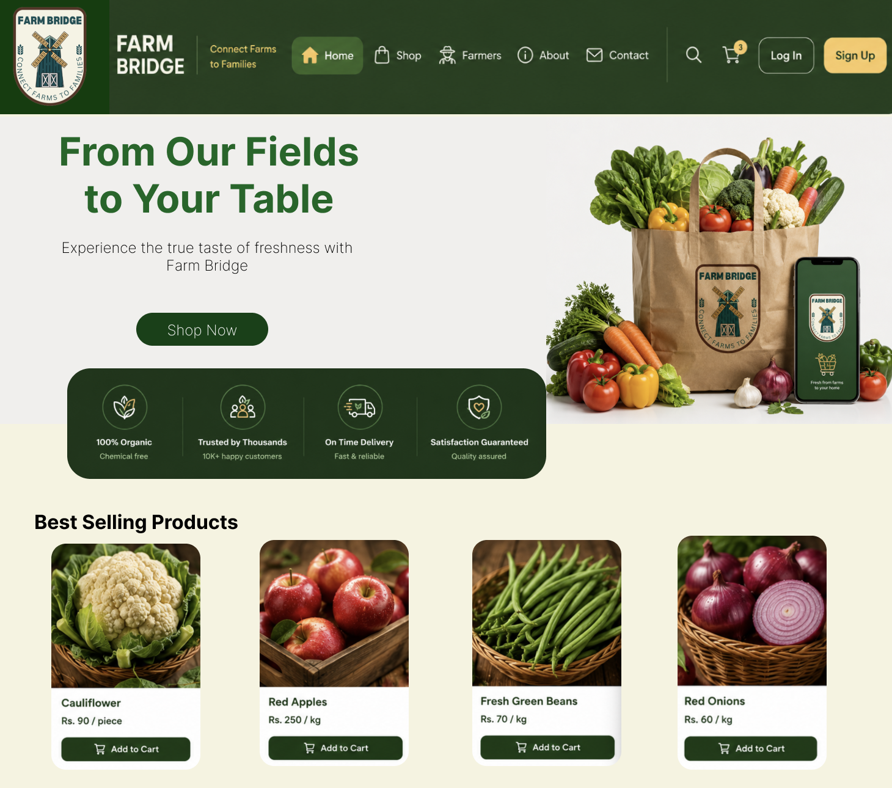
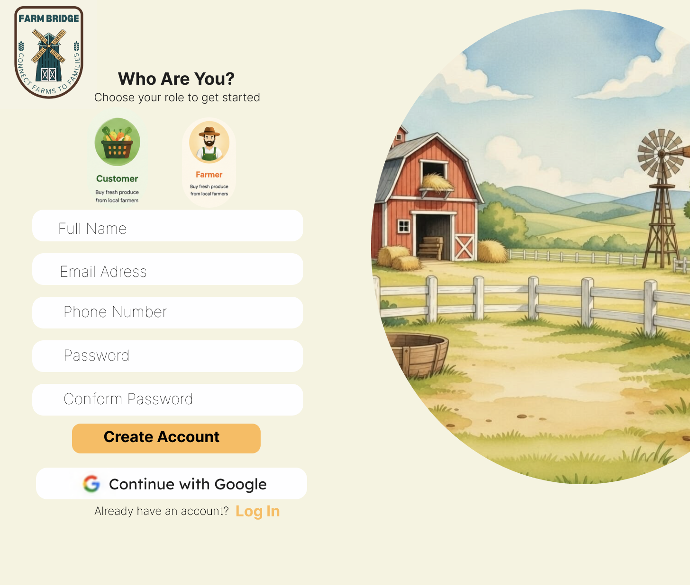
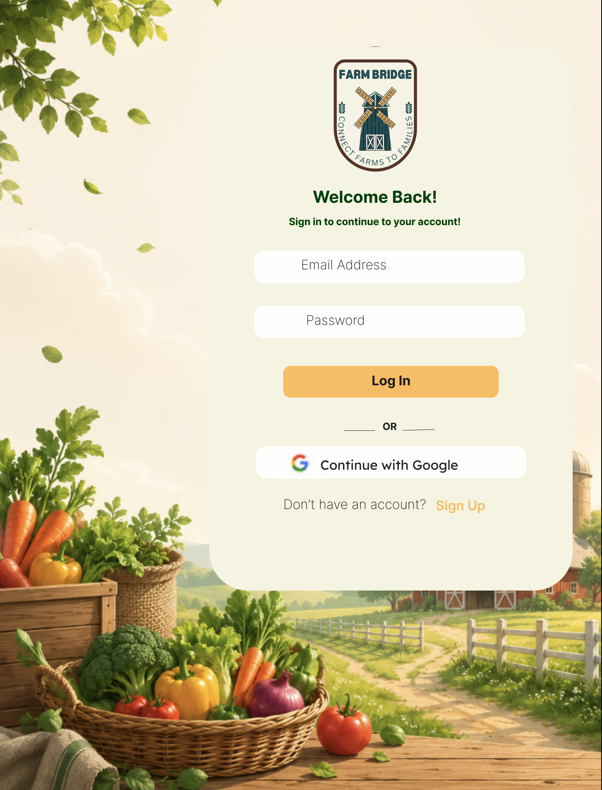
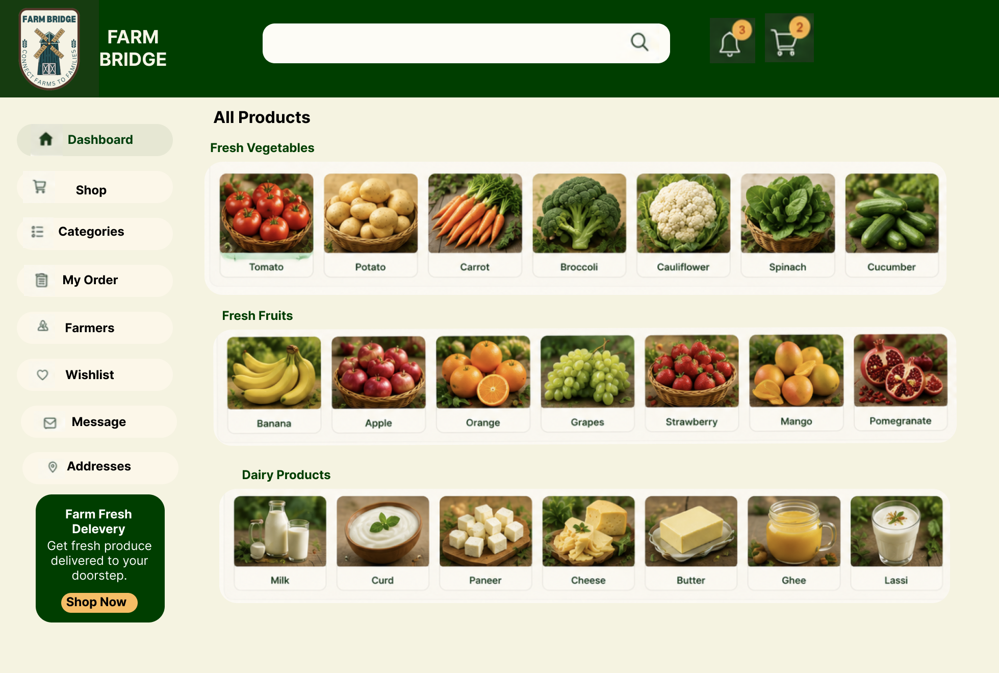
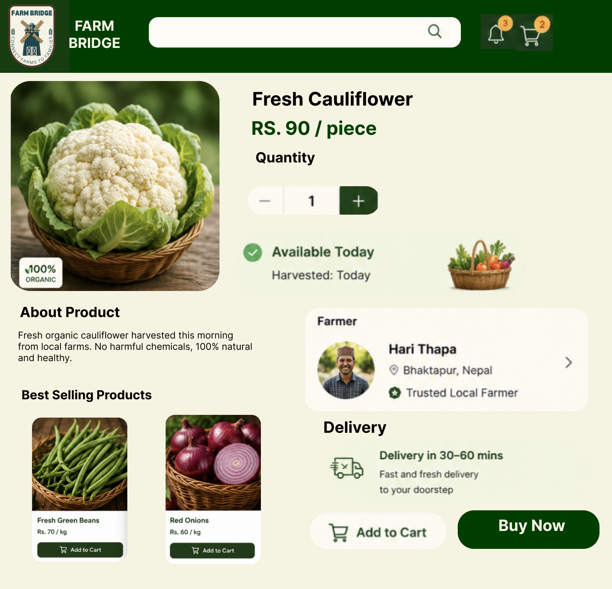

# FarmBridge – UI/UX Case Study

FarmBridge is a UI/UX concept for a mobile marketplace that connects farmers directly with customers. The idea behind the project was to remove unnecessary middlemen so that customers receive fresher products while farmers are able to sell at fair prices.

This project was created as a design case study to explore how a simple and intuitive mobile experience could make buying farm-fresh produce easier.

**Figma Design:**  
[View Design](https://www.figma.com/design/SyOTENHX9QmSS6Go7Dco3x/FarmBridge-UI-UX?node-id=0-1&t=q0Sn3BVjkpF2MXsV-1
)

---

## Project Goal

The goal was to design an application that feels straightforward for everyday users while keeping the interface clean and easy to navigate.

The design focuses on:

- Direct farmer-to-customer interaction
- A simple shopping experience
- Minimal visual clutter
- Fresh and approachable branding

---

## Design Process

### Understanding the Problem

The first step was identifying the main issue in the current supply chain. Farmers often sell their produce through multiple intermediaries, which reduces their profit while increasing prices for customers.

The application aims to shorten that journey by allowing customers to purchase directly from local farmers.

---

### User Flow

The user journey was intentionally kept simple.

```
Landing Page
      ↓
 Sign Up / Login
      ↓
 Browse Products
      ↓
 Add to Cart
      ↓
 Checkout
```

Every screen was designed around this flow so users never feel lost while navigating the application.

---

### Visual Direction

The visual language is inspired by agriculture and freshness.

- Soft green color palette
- Clean typography
- Plenty of white space
- Rounded cards and buttons
- Simple iconography

The intention was to create an interface that feels trustworthy, modern, and easy to use.

---

## Screens

### Landing Page



The landing page introduces the platform and communicates its purpose with a simple layout and clear call-to-action.

---

### Sign Up



The registration screen keeps the form minimal so new users can create an account quickly.

---

### Login



A clean authentication screen that follows the same visual language as the rest of the application.

---

### Product Catalog



The catalog was designed to make browsing products effortless. Cards are kept simple, allowing users to focus on the product image, name, and price without unnecessary distractions.

---

### Cart



The cart provides a clear overview of selected products before checkout while maintaining a clean layout.

---

## Complete Design

<p align="center">


</p>

---

## Design Decisions

Some of the decisions made while designing the interface include:

- Keeping the navigation familiar and predictable.
- Reducing the number of actions required to purchase products.
- Using generous spacing to improve readability.
- Maintaining visual consistency across all screens.
- Prioritizing product images over decorative elements.

---

## Tools

- Figma
- Auto Layout
- Components
- Variants
- Prototyping

---

## Future Improvements

If this concept were developed further, I would like to include:

- Farmer profiles
- Product reviews
- Live order tracking
- Secure payments
- Search and filtering
- Wishlist
- Personalized recommendations

---

## Designer

**Pratyusha Basnet**

This project was created as part of my UI/UX portfolio to practice solving a real-world problem through user-centered design.
